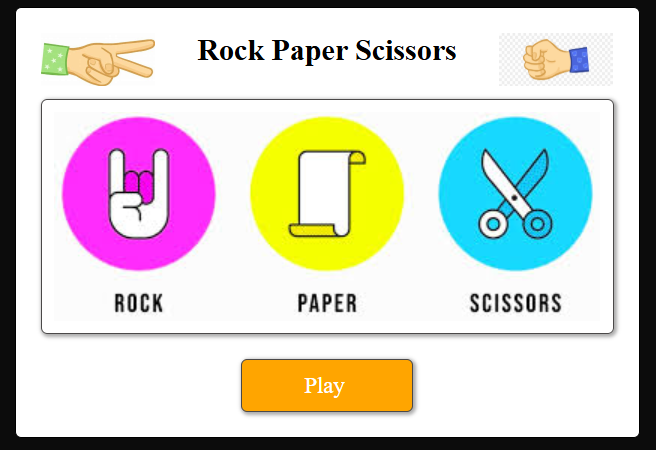
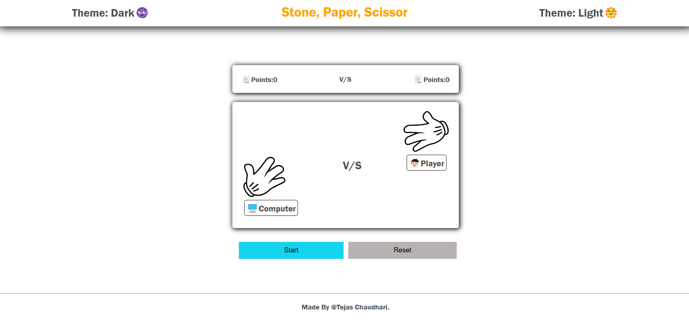
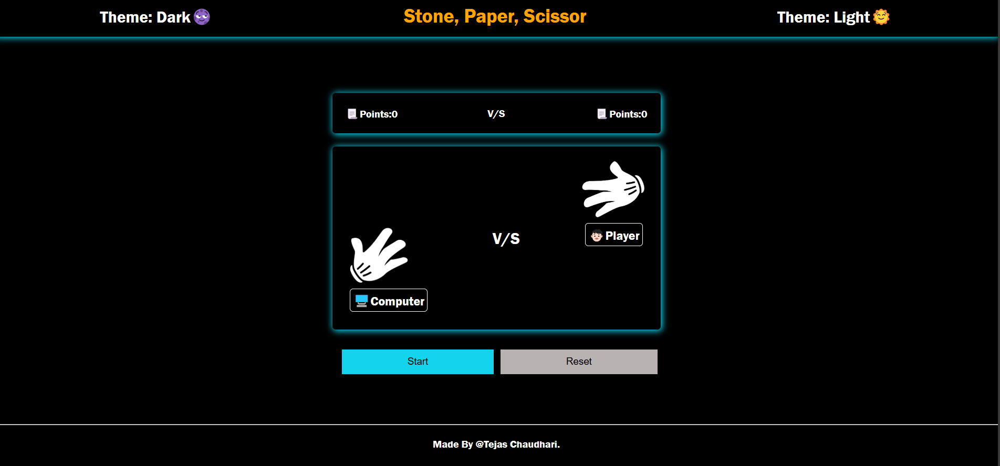

# 🪨📄✂️ Stone Paper Scissors Game  

A simple and interactive **Rock-Paper-Scissors** game built using **HTML, CSS, and JavaScript**. Play against the computer and see if you can win! 🎮  

## 🚀 Features  
- 🎨 Clean and responsive UI  
- 🤖 Random Computer generated moves  
- 🏆 Score tracking for both player and computer  
- ⚡ Manage Theme of game.
- 🎺 Win, and lose Sound.

## 📷 Preview  
#### 🎮 Start Screen  


#### 🕹️ Gameplay  


#### Dark Theme


## 🛠️ Technologies Used  
- **HTML** – Structure  
- **CSS** – Styling  
- **JavaScript** – Game logic  

## ▶️ How to Play  
1. Click on **Rock**, **Paper**, or **Scissors**.  
2. The computer will randomly choose its move.  
3. The winner is decided based on standard rules:  
   - Rock beats Scissors  
   - Scissors beats Paper  
   - Paper beats Rock  
4. Keep playing and track your score!  

## 🔧 Setup & Run  
1. Clone the repository:  
   ```bash
   git clone https://github.com/Tejas-Chaudharigithub25/SPS-Stone-Paper-Scissor-Game.git
   ```  
2. Open the `index.html` file in your browser.  
3. Enjoy the game! 🎉  
